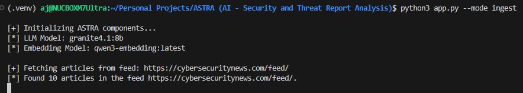
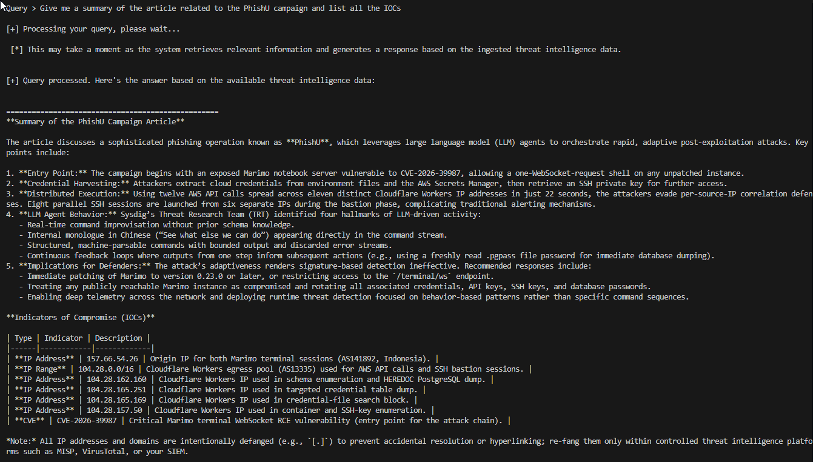

# 🌌 ASTRA: AI - Security & Threat Report Analysis

> **Automated Local Threat Intelligence Extraction & RAG Pipeline (Configurable LLMs & Embeddings)**

[](https://ollama.com)
[](https://github.com/langchain-ai/langchain)
[](https://github.com/chroma-core/chroma)
[](#)

ASTRA is a privacy-first, zero-cost, local intelligence pipeline that ingests cybersecurity RSS feeds, extracts and validates Indicators of Compromise (IOCs), and enables fast, metadata-filtered retrieval using a configurable RAG (Retrieval-Augmented Generation) system. All LLM and embedding models are user-configurable and run locally via Ollama.

---
## ✨ Features
- Local-only, air-gapped threat intelligence pipeline
- RSS feed ingestion, deduplication, and full article storage
- LLM-powered IOC extraction (IPs, subnets, domains, URLs, hashes, CVEs)
- Robust Pydantic validation
- Chroma vector database for fast, metadata-filtered retrieval
- Interactive CLI for analyst queries

## 🏗️ Architecture & Processing Lifecycle   
The architecture uses a decoupled layout separating Ingestion & Data Extraction from Context Retrieval & Prompt Synthesis.
```
                                  [ INGESTION FLOW ]
                                           │
  ┌─────────────────┐       ┌──────────────▼──────────────┐       ┌──────────────────────┐
  │  RSS Feeds XML  ├──────►│   SQLite Duplicate Filter   ├──────►│  Clean and normalize │
  └─────────────────┘       └──────────────┬──────────────┘       └──────────┬───────────┘
                                           │ (If Already Parsed)             │
                                           ▼                                 ▼
                                      [ Skip Item ]              ┌───────────────────────┐
                                                                 │ Local LLM (Ollama)    │
                                                                 └──────────┬────────────┘
                                                                            │ (IOC Extraction)
                                                                            ▼
  ┌─────────────────┐       ┌─────────────────────────────┐       ┌──────────────────────┐
  │ Local Chroma DB │◄──────┤ Dense Summary Generation    │◄──────┤ Pydantic Validation  │
  └────────┬────────┘       └─────────────────────────────┘       └──────────────────────┘
           │
           │                      [ QUERYING FLOW ]
           │
           ▼
  ┌──────────────────────────┐       ┌─────────────────────────────┐       ┌──────────────────────┐
  │Full Article stored in DB ├──────►│ Context Insertion to Prompt ├──────►│ Analyst Output (LLM) │
  └──────────────────────────┘       └─────────────────────────────┘       └──────────────────────┘
```

1. **Ingestion:**
  - Fetches articles from configured RSS feeds.
  - Deduplicates using SQLite (`rss_feeds.db`).
  - Cleans and normalizes article content (preserves tables/lists for LLM extraction).
2. **IOC Extraction:**
  - Uses a local LLM (configurable, e.g., granite4.1:8b, qwen3.5:27b, llama3, etc.) via Ollama.
  - Extracts IOCs from both narrative and structured (table/list) formats using a robust prompt.
  - Validates IOCs with Pydantic (supports IPs, subnets, hashes, etc.).
3. **Summary Generation:**
  - Generates dense, information-rich summaries for semantic search.
4. **Storage:**
  - Stores summaries and metadata in ChromaDB (vector store).
  - Stores full article content and metadata in SQLite for reference and deduplication.
5. **Querying:**
  - Analyst queries are pre-filtered using metadata (e.g., has_ips, has_domains).
  - Retrieves relevant articles and full content for LLM-based answers.
  - Interactive CLI supports natural language queries and IOC lookups.

---
## 🔧 Installation & Setup

### Requirements
- Python 3.10+
- [Ollama](https://ollama.com/) (for local LLMs and embeddings)
- [ChromaDB](https://docs.trychroma.com/)

### Install dependencies
```bash
pip install -r requirements.txt
```

### Pull Models via Ollama
Edit the model names in `app.py` to match your preferred LLM and embedding models. Example:
```python
LLM_MODEL = "granite4.1:8b"  # or qwen3.5:27b, llama3:8b, etc.
EMBEDDING_MODEL = "qwen3-embedding:latest"  # or bge-large, nomic-embed-text, etc.
```
Then pull the models:
```bash
ollama pull granite4.1:8b
ollama pull qwen3-embedding:latest
```

---
## 🚀 Usage

### Ingest Articles
```bash
python app.py --mode ingest
```

### Query the RAG
```bash
python app.py --mode query
```

---
## 🖥️ Example CLI Session
```text

[+] Initializing ASTRA components...
[*] LLM Model: granite4.1:8b
[*] Embedding Model: qwen3-embedding:latest

==================================================

[+] Entering ASTRA - interactive query mode.

==================================================

[Instructions]
 - Type your threat intelligence query and press Enter to get an answer based on the ingested data.
 - Commands: Type 'exit' or 'quit' to leave the interactive mode.

Query > Give me a list of the title and category and count of IOCs extracted for each article                 

[+] Processing your query, please wait...

 [*] This may take a moment as the system retrieves relevant information and generates a response based on the ingested threat intelligence data.


[+] Query processed. Here's the answer based on the available threat intelligence data: ...
```

---

## ⏱️ Optional Automation Scheduling
To keep ASTRA continually running in the background completely hands-free, you can configure your operating system's native scheduler

---

## Sample Output
1. ASTRA: Ingestion

---
2. ASTRA: Extraction results

---
3. ASTRA: Validator

---
4. ASTRA: Query


---

## 🗂️ Data Storage
- **ChromaDB:** Stores summaries and metadata for fast vector search.
- **SQLite:** Stores full article content and deduplication info.

---
## 🔒 Security & Privacy
All LLM inferences and embeddings are performed locally. No data or indicators are sent to external APIs. Safe for sensitive threat intelligence workflows.

---
## 🛠️ Troubleshooting
- Ensure Ollama and Chroma services are running and accessible.
- Use Python 3.10 or newer for best compatibility.
- Edit model names in `app.py` to match your available Ollama models.

---
## 🤝 Contributing
Pull requests and issues are welcome! Please open an issue to discuss your ideas or report bugs.

---
## 📄 License
MIT License. See LICENSE file for details.