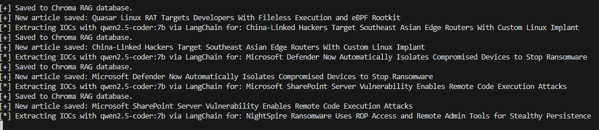
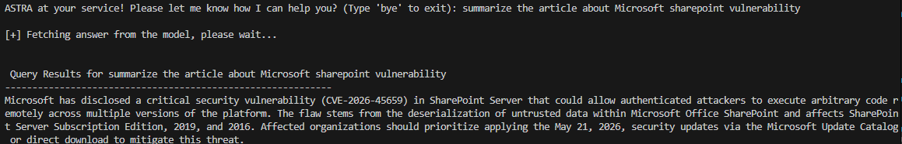
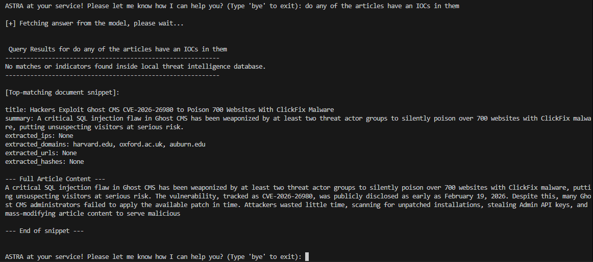

# 🌌 ASTRA: AI - Security & Threat Report Analysis

> **Automated Local Threat Intelligence Extraction & Metadata-Routed RAG Pipeline**

[](https://ollama.com)
[](https://github.com/langchain-ai/langchain)
[](https://github.com/chroma-core/chroma)
[](#)

ASTRA is a privacy-first, zero-cost, localized intelligence pipeline designed to monitor cyber security RSS feeds, systematically extract verified Indicators of Compromise (IOCs), deduplicate incoming reports, and organize them into an accelerated, metadata-filtered Vector Database (RAG) system.


## ✨ Features
- Local-only, air-gapped threat intelligence pipeline
- RSS feed ingestion and deduplication
- LLM-powered IOC extraction (IPs, domains, URLs, hashes)
- Pydantic validation for data quality
- Chroma vector database for fast retrieval
- Interactive CLI for analyst queries

## 🏗️ Architecture & Processing Lifecycle   
The architecture uses a decoupled layout separating Ingestion & Data Extraction from Context Retrieval & Prompt Synthesis.
```
                                  [ INGESTION FLOW ]
                                           │
  ┌─────────────────┐       ┌──────────────▼──────────────┐       ┌──────────────────────┐
  │  RSS Feeds XML  ├──────►│   SQLite Duplicate Filter   ├──────►│  Regex Defang Clean  │
  └─────────────────┘       └──────────────┬──────────────┘       └──────────┬───────────┘
                                           │ (If Already Parsed)             │
                                           ▼                                 ▼
                                      [ Skip Item ]              ┌───────────────────────┐
                                                                 │ qwen2.5-coder Check   │
                                                                 └──────────┬────────────┘
                                                                            │ (JSON Extraction)
                                                                            ▼
  ┌─────────────────┐       ┌─────────────────────────────┐       ┌──────────────────────┐
  │ Local Chroma DB │◄──────┤ nomic-embed-text Embeddings │◄──────┤ Pydantic Validation  │
  └────────┬────────┘       └─────────────────────────────┘       └──────────────────────┘
           │
           │                      [ QUERYING FLOW ]
           │
           ▼
  ┌─────────────────┐       ┌─────────────────────────────┐       ┌──────────────────────┐
  │ Metadata Filter ├──────►│ Context Insertion to Prompt ├──────►│ Analyst Output (LLM) │
  └─────────────────┘       └─────────────────────────────┘       └──────────────────────┘
```

1. **Deduplication Engine:** Intercepts incoming articles against a tracking ledger table (`rss_feeds.db`). Duplicate resources skip extraction entirely.
2. **Structural Information Extraction:** Routes text items to `qwen3.5:27b`. It generates a reliable JSON block containing summaries, IPs, URLs, and file hashes.
3. **Pydantic Validation Layer:** Evaluates format validity (IP routing verification and cryptographic hash string length parameters) to eliminate hallucinations.
4. **Metadata Optimization:** Tags records natively inside Chroma (`has_ips: True/False`).
5. **Context Pre-Filtering Query Routing:** Filters search targets using metadata flags *prior* to calculating vector math, speeding up target data delivery.

---
## 🔧 Installation & Setup

### Requirements
- Python 3.10+
- [Ollama](https://ollama.com/) (for local LLM)
- [ChromaDB](https://docs.trychroma.com/)

### Install dependencies
```bash
pip install -r requirements.txt
```

### Pull Models via Local Ollama Daemon
```bash
ollama pull qwen3.5:27b
ollama pull nomic-embed-text
```

## 🚀 Execution Instructions
Run the primary orchestration script to start the ingestion engine and open the interactive analyst console:

```bash
python app.py
```

### Ingestion Mode
The script initializes the local SQLite tracking DB, queries the pre-configured RSS feeds, filters duplicates, cleans raw entries, and packages the results into the Chroma vector database.

### Interactive Query Mode (ASTRA CLI)
Once ingestion completes, the ASTRA terminal loop launches automatically. Type questions naturally. The engine scans your input for indicator keywords (`ip`, `domain`, `hash`, `url`) to dynamically construct metadata filters

```text
ASTRA at your service! Please let me know how I can help you? (Type 'bye' to exit): 

User: Show me malicious domains or IPs related to recent phishing campaigns.
[*] Querying RAG: 'Show me malicious domains or IPs related to recent phishing campaigns.' 
[*] Active Filters: {'$or': [{'has_ips': True}, {'has_domains': True}]}

[+] Found 2 relevant threat intel reports:
--- Result 1 ---
Title: New Phishing Campaign Exploits Security Flaws
Source: https://cybersecuritynews.com
Snippet: title: New Phishing Campaign Exploits... extracted_ips: 192.168.1.50...
```

---

## ⏱️ Optional Automation Scheduling
To keep ASTRA continually running in the background completely hands-free, you can configure your operating system's native scheduler

---

## Sample Output




---

## 🔒 Security & Privacy Notice
ASTRA processes all LLM inferences and vector embeddings completely on your local loop. No data, indicators, or source report strings are ever leaked to external cloud APIs, making it completely safe for sensitive Corporate Threat Intelligence operations.

---

## 🛠️ Troubleshooting
- Ensure Ollama and Chroma services are running and accessible.
- Use Python 3.10 or newer for best compatibility.

---

## 🤝 Contributing
Pull requests and issues are welcome! Please open an issue to discuss your ideas or report bugs.

---

## 📄 License
MIT License. See LICENSE file for details.